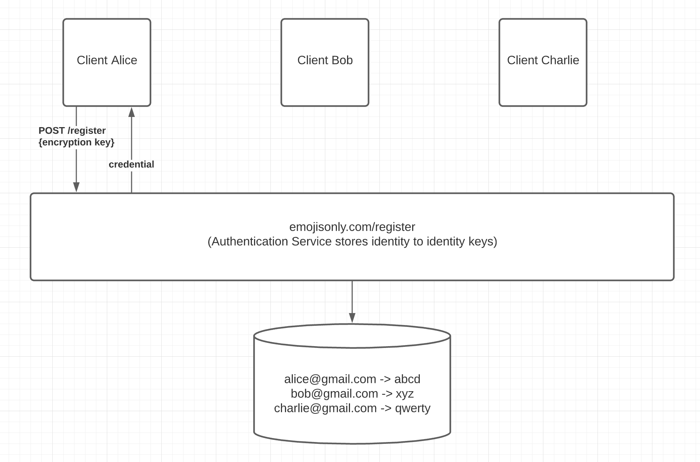
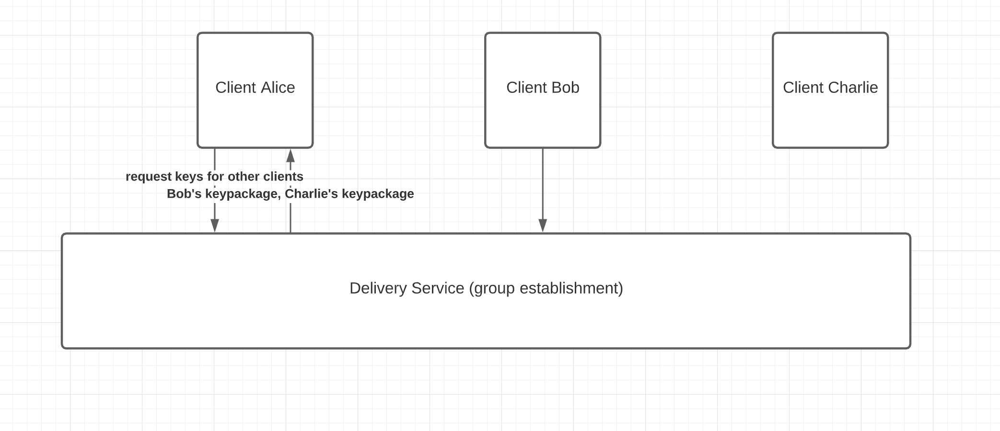

# MLS Explainer

- Protocol draft: https://github.com/mlswg/mls-protocol
- Architecture draft: https://github.com/mlswg/mls-architecture

## Introduction
TODO

## Goals
TODO

### Why not Signal?
TODO

## Architecture

Let's imagine a hot new messaging app called EmojisOnly - a messaging app that only lets you send emojis to your friends. The creators of EmojisOnly are staunch defenders of their users' right to send unsurveilled emojis, so they decide to use MLS. What would the architecture of their app look like?

MLS requires two main services:

1. Authentication Service
2. Delivery Service

An authentication service maintains record of the users' identity to identity key mapping. In other words, an authentication service would be how an app stores the fact that alice@mail.com has an identity key ABCD.

In this diagram, when Alice or Bob or Charlie join EmojisOnly, the Authentication Service running the backend stores their {email addresses,identity key} mappings. Note that because the AS is storing a long-lived identity key, it is crucial that this service not be compromised!

After the AS has successfully registered them, it will send Alice a credential. A credential is proof that Alice is the user with email address alice@mail.com and this is her signature key. Note that a credential could also just be an X509 certificate!

Thus far, we've been talking about Alice, Bob etc as if they were Clients. However, the truth is that a user (or a person) can have multiple Clients - if you use WhatsApp Web along with the WhatsApp on your phone, these would be considered two separate clients (phone, browser) for the same user (you). The MLS protocol fully supports this one-user-multiple-client model. In MLS, a Client is defined as a collection of:
1. Name
2. Encryption key pair
3. Signature key pair

The credential sent by the AS contains Alice's generated signature key, whereas Alice would generate her own encryption key. Why two key pairs, you ask? This way, the AS is able to prove that Alice's identity (so that no one can impersonate her), but the AS is not able to read Alice's messages (because only she knows her encryption private key).

Now, let's say Alice wants to form a group with Bob and Charlie. To do this, she needs to check:
1. if Bob and Charlie are actually on EmojisOnly
2. if they are, what their keys are so that she can send them emojis securely

Here is where the Delivery Service comes in. Before Alice can start sending emojis on EmojisOnly, her app needs to also register with the Delivery Service.

Alice generates an encryption keypair for her client and bundles the public key with the credential she received from the AS and sends it to the DS. This bundle is called a 'Key Package'. Note that these Key Packages are all public-friendly information - the DS can store these in a directory, and in fact the DS can let Alice search this directory for her friends, Bob and Charlie! Bob and Charlie would also have generated and sent their Key Packages to the DS, so Alice is able to find them and download their Key Packages to her client. Note that Alice, Bob or Charlie could update their Key Packages at any time - this prevents an attacker from being able to read all past messages. In fact, EmojisOnly can also require that its users regularly update their Key Packages, so that even if Alice's encryption key is compromised, an attacker can't read all past and future group messages.

The cool thing is that Alice does not have to trust the DS for proof that Bob's Key Package is actually Bob's - she can just verify the Key Package by querying the AS! Of course, there's no getting around trusting the AS.

TODO: rest of this.

Note: the diagrams were made using LucidChart, editable link here: https://lucid.app/lucidchart/invitations/accept/75a3f6da-3f9b-46a5-b943-cc0408c227d8

## The Protocol

What is TreeKEM?
Group Creation, Group Update (adding/removing a member), Group Destroy,
Sending a message.

## Who all are working on this?

Made with love by Shivan Kaul and Sofía Celi
